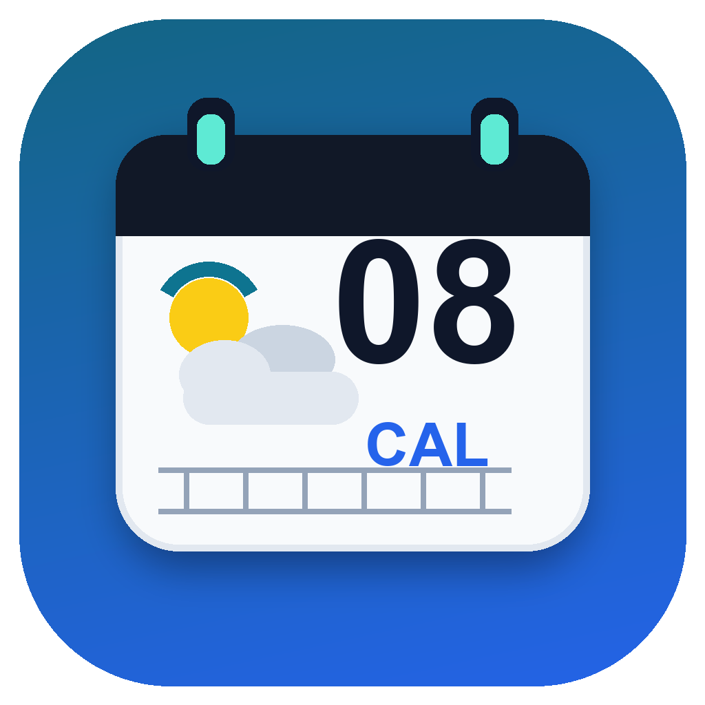
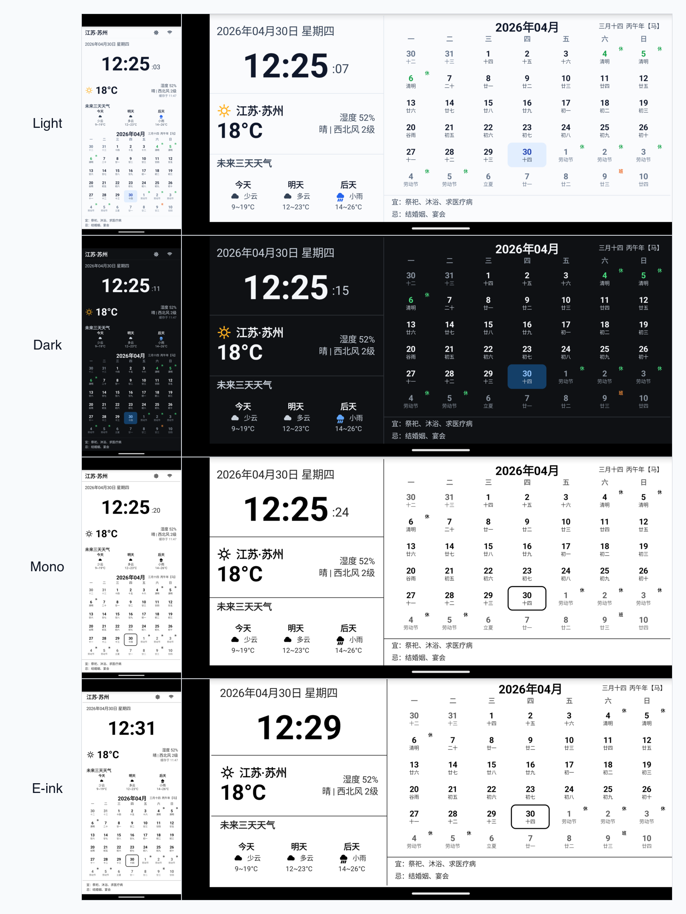

<p align="center">
  
</p>

<h1 align="center">OpenDeskCalendar</h1>

<p align="center">
  <a href="https://github.com/wwek/OpenDeskCalendar/actions/workflows/android-build.yml"></a>
  
  
  
  
</p>

OpenDeskCalendar 是一個面向舊手機、舊平板和 Android 電子紙裝置的開源桌面日曆天氣屏。

目前倉庫已經實作 `v0.1.3-beta` 原生 Android 版本，需求來源見 `docs/open_desk_calendar_prd.md`。

## 介面預覽

淺色、深色、黑白、電子紙主題均支援直向和橫向。

<p align="center">
  
</p>

## 目前範圍

本 alpha 已實作：

- 原生 Android 工程，最低支援 Android 4.1 Jelly Bean（API 16，`minSdkVersion 16`）。
- 全螢幕、常亮的桌面資訊屏。
- 橫屏優先主介面：大時鐘、日期、農曆、天氣、三日預報、月曆、Wi-Fi 狀態和宜忌。
- 直向螢幕適配版面。
- 淺色、深色、黑白、電子紙主題。
- 本地農曆、節氣、傳統節日，以及 2026 中國大陸休/班角標。
- Open-Meteo 天氣源和本地快取回退。
- 城市搜尋和手動經緯度輸入。
- HTTP / Home Assistant JSON 室內溫濕度接入。
- 設定頁：外觀、天氣、室內溫濕度、日曆、自動啟動、桌面模式、診斷。
- 使用者主動開啟的開機自動啟動。
- Home/Launcher Activity，以及長按進入設定和系統入口的防鎖死路徑。
- 夜間自動降亮度、退出確認開關和診斷日誌匯出。
- 預設開啟的防烙印輕微位移。
- 本機自簽名 release 腳本和 GitHub Actions release 建置入口。
- 簡體中文和繁體中文介面資源。

尚未完成：

- 直接 MQTT 客戶端接入。
- 假日資料線上更新。
- 多城市輪播。
- 空氣品質和天氣預警。
- 自訂天氣介面欄位映射。

## 建置

需求：

- Android 4.1 Jelly Bean（API 16）或更高版本的裝置 / 模擬器。
- 已安裝 Android SDK。
- JDK 8。
- 首次建置需要網路存取，Gradle Wrapper 會下載 Gradle 6.9.4。

建置 debug APK：

```sh
./gradlew --no-daemon :app:assembleDebug
```

建置、安裝並啟動到目前模擬器：

```sh
./scripts/run-emulator.sh
```

如果沒有正在執行的模擬器，腳本會嘗試啟動本機第一個 AVD。也可以明確指定裝置：

```sh
./scripts/run-emulator.sh emulator-5554
```

輸出：

```text
app/build/outputs/apk/debug/app-debug.apk
```

## Release 自簽名

這是開源專案，倉庫不會包含作者的 release keystore，作者也不會上傳自己的簽名私鑰。自行編譯或 fork 發布時，請產生並保管你自己的簽名；同一個 APK 後續升級必須使用同一個 keystore。

本機建置帶簽名 APK：

```sh
./scripts/build-release.sh
```

首次執行如果沒有簽名設定，腳本會自動產生本機 keystore，並寫入已忽略的 `local.properties`。也可以提前手動產生：

```sh
./scripts/create-release-keystore.sh
```

輸出：

```text
app/build/outputs/apk/release/app-release.apk
```

預設 keystore 路徑是 `.local/signing/opendeskcalendar-release.jks`。請備份這個檔案和 `local.properties` 裡的密碼；遺失後將無法用同一簽名身分更新已經安裝的 release APK。

CI 或其他機器也可以用環境變數提供簽名設定：

```sh
OPEN_DESK_CALENDAR_STORE_FILE=/path/to/release.jks
OPEN_DESK_CALENDAR_STORE_PASSWORD=...
OPEN_DESK_CALENDAR_KEY_ALIAS=opendeskcalendar
OPEN_DESK_CALENDAR_KEY_PASSWORD=...
```

如果你要讓自己的 GitHub Actions 在推送 tag 後自動發布簽名 APK，需要把自己的 keystore 配到自己倉庫的 Secrets。先轉成單行 base64：

```sh
base64 < .local/signing/opendeskcalendar-release.jks | tr -d '\n'
```

在 GitHub 倉庫的 `Settings` -> `Secrets and variables` -> `Actions` 新增這些 Repository secrets：

```text
OPEN_DESK_CALENDAR_RELEASE_KEYSTORE_BASE64
OPEN_DESK_CALENDAR_STORE_PASSWORD
OPEN_DESK_CALENDAR_KEY_ALIAS
OPEN_DESK_CALENDAR_KEY_PASSWORD
```

也可以用腳本寫入目前 GitHub 倉庫的 Actions secrets：

```sh
gh auth login
./scripts/configure-github-release-secrets.sh
```

PR 和 `main` 分支只建置 debug APK。推送 `v*` tag 時，GitHub Actions 會讀取這些 secrets 建置簽名 release APK，上傳 workflow artifact，並建立 / 更新 GitHub Release，附加 `OpenDeskCalendar-vX.Y.Z.apk`。

一鍵發布新版本：

```sh
./scripts/release-tag.sh 0.1.2-alpha
```

這個腳本會：

1. 要求工作區乾淨。
2. 更新 `versionCode`、`versionName` 和 README 徽標。
3. 提交版本變更。
4. 本機建置並驗證簽名 APK。
5. 建立 `v0.1.3-beta` tag。
6. 推送目前分支和 tag，觸發 GitHub Actions 自動建置簽名包並發布 Release。

Tag 必須指向已提交的程式碼，所以實際順序是「先提交，再打 tag，再 push」。腳本已經按這個順序處理。

## 執行說明

- 預設城市是北京海淀。
- 預設天氣源是 Open-Meteo，不需要 API Key；也可在設定裡切換到和風天氣。
- 使用和風天氣時需要填寫自己的 Base API 和 Key/JWT。
- 天氣更新失敗時，主屏會繼續顯示快取或內建回退資料。
- API Key 寫入診斷錯誤前會被脫敏。
- 開機自動啟動預設關閉，必須由使用者主動開啟。
- Home 桌面模式不會靜默啟用，必須由使用者在 Android 系統桌面選擇器中手動選擇。
- 介面語言跟隨系統語言；`zh-TW` / `zh-HK` / `zh-MO` 會顯示繁體中文。

## 資料來源

- 天氣：Open-Meteo 公共 API，或使用者設定的和風天氣 API。
- 宜忌：基於 MIT 授權的 cnlunar 離線資料，覆蓋 2026-2099，不構成建議。

## 免責聲明

本專案是一個開源專案，作者和貢獻者盡力讓它穩定、準確、可用，但不承諾它一定適合你的裝置、場景或用途，也不保證它始終可用、完全準確或沒有錯誤。本免責聲明是對專案開源授權中無擔保和責任限制條款的補充，不替代或削弱 LICENSE 檔案中的條款。

OpenDeskCalendar 顯示的天氣、農曆、節氣、節假日、宜忌等資訊僅用於桌面展示和傳統文化參考，不構成氣象、醫療、法律、出行、祭祀、婚喪嫁娶或其他現實決策建議。天氣資料來自第三方服務或使用者自行設定的介面，可能存在延遲、缺失或錯誤；農曆與宜忌資料也可能因資料來源、地區習慣和曆法口徑不同而存在差異。請勿將本應用作為唯一依據，重要事項請以官方發布、專業機構或實際情況為準。

本應用可能被用於舊手機、舊平板、電子紙裝置或長期亮屏場景。長期通電、常亮顯示、裝置老化、散熱條件、電池健康狀態、充電器或線材品質等因素可能帶來烙印、發熱、鼓包、續航下降、電池老化、裝置損壞、資料遺失或其他硬體與安全風險。使用者應根據裝置狀況自行評估使用方式，並避免在無人看管、高溫、潮濕、易燃、散熱不良或供電不穩定的環境中長期執行。

在適用法律允許的最大範圍內，使用者應自行判斷並承擔安裝、執行、依賴或長期使用本應用及其顯示資訊所產生的風險。專案作者和貢獻者不對因此造成的任何直接、間接、偶然、特殊、懲罰性或後果性損失承擔責任，包括但不限於資料遺失、裝置損壞、電池老化、人身傷害、財產損失、業務中斷或其他損失。

## 授權

見 `LICENSE`。
